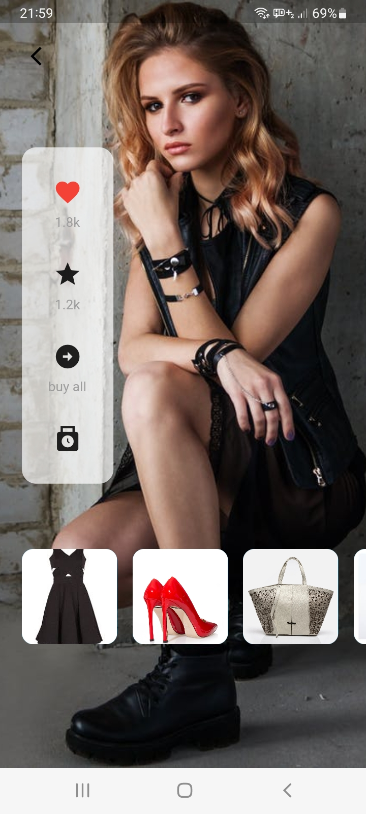
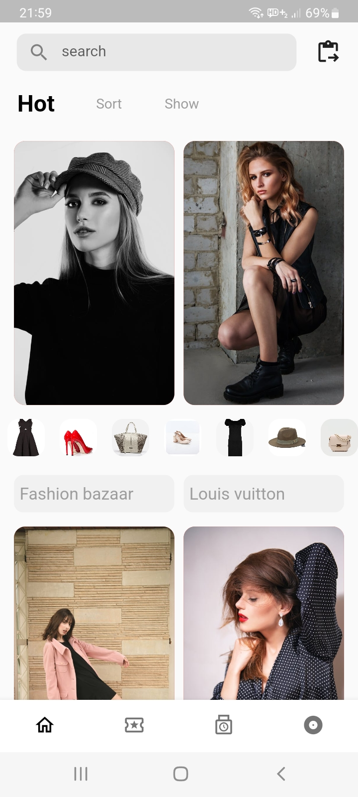

# FashionDesignApp

## 🤓 Author

I'm Hafiz Ramiz, a passionate Mobile Developer with a love for Flutter and Jetpack Compose. 
Connect with me on [LinkedIn](https://www.linkedin.com/in/hafizramiz/) and [GitHub](https://github.com/hafizramiz).

## 🌟 Show Your Support

If you find this project interesting or helpful, consider giving it a star ⭐️. It means a lot!

Happy coding! 🚀
